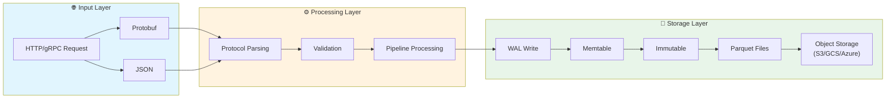
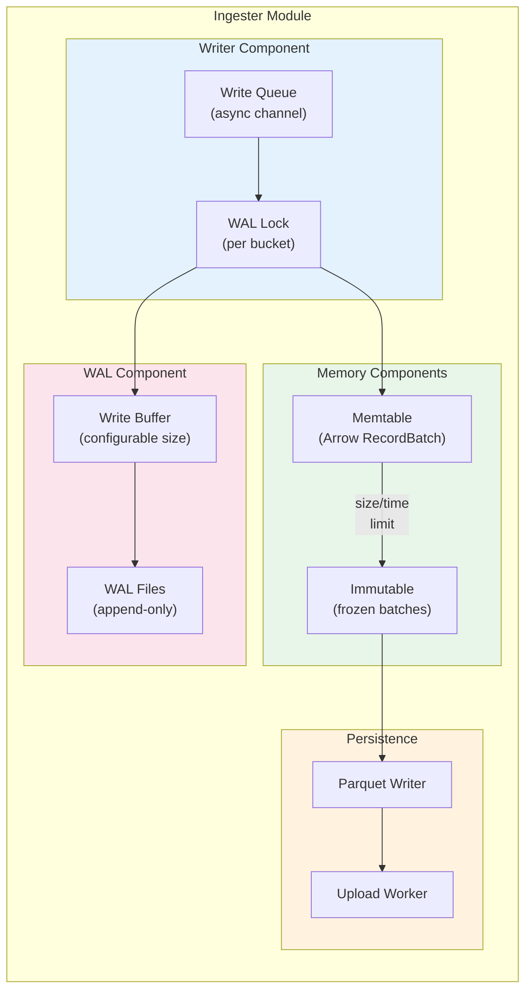
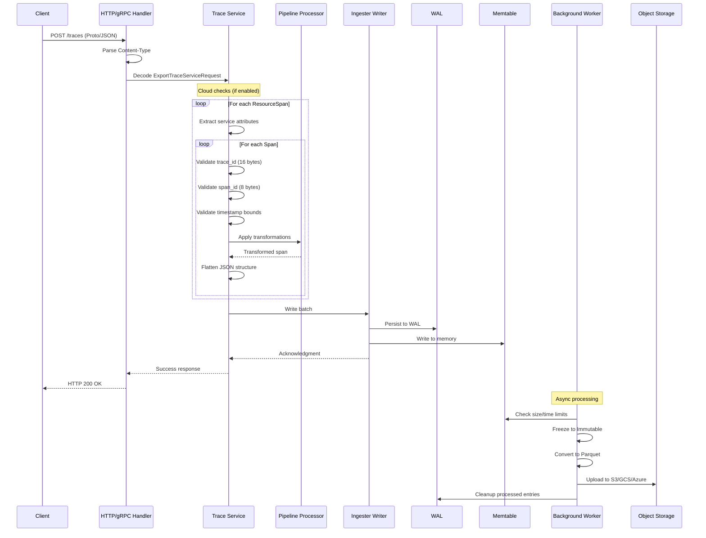
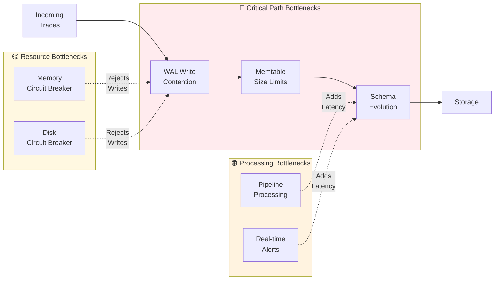
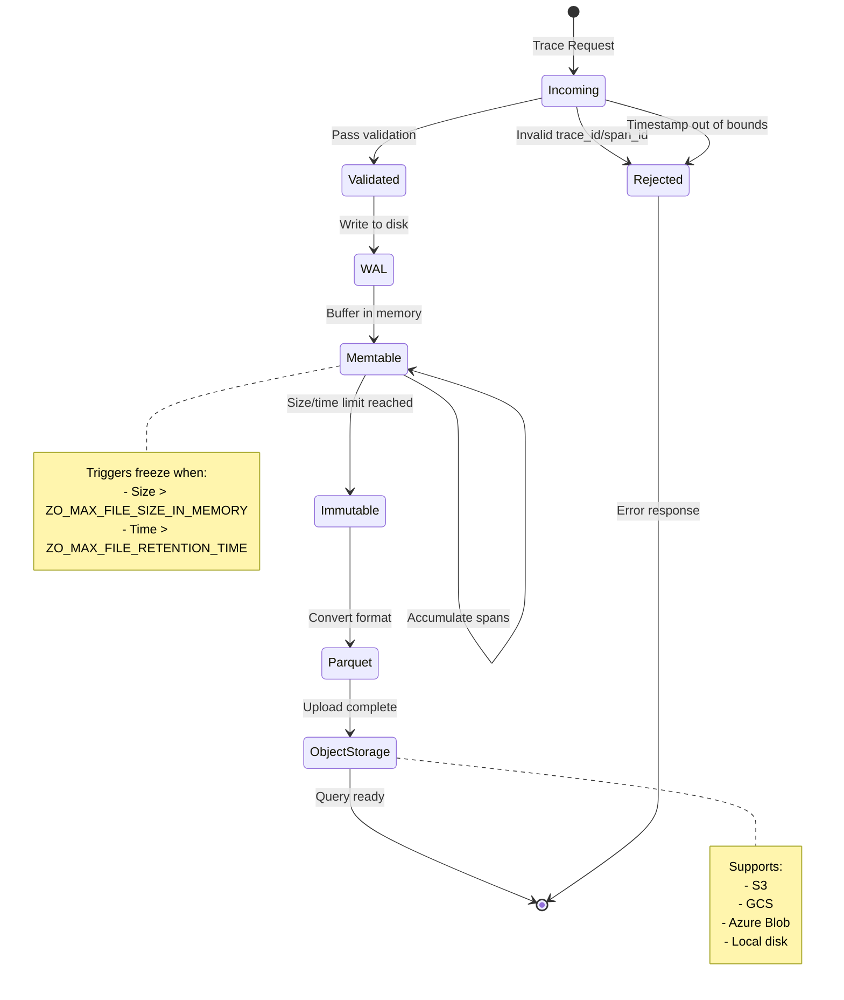
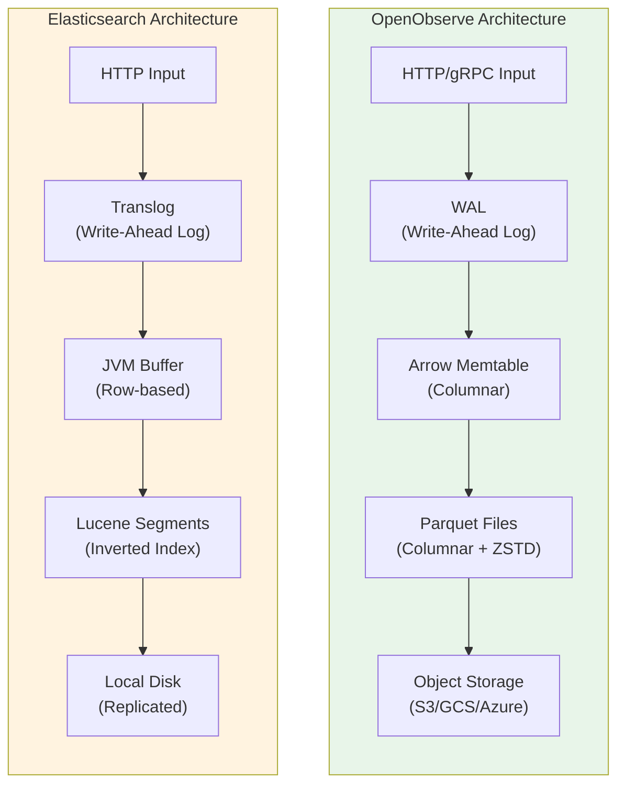
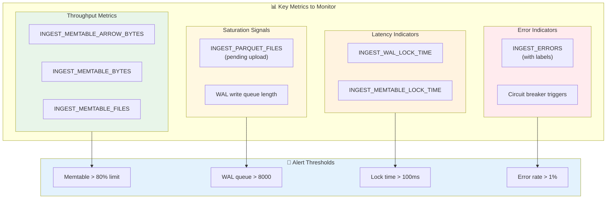

# OpenObserve Trace Ingestion Audit

## Executive Summary

This audit examines the trace ingestion pipeline in OpenObserve, identifying architectural strengths, potential bottlenecks, and comparing the approach against Elasticsearch's traditional ingestion patterns. OpenObserve's architecture provides significant advantages in storage cost (claimed 140x reduction) and ingestion throughput through its columnar storage approach and modern Rust-based implementation.

---

## Table of Contents

1. [Trace Ingestion Architecture](#trace-ingestion-architecture)
2. [Data Flow Analysis](#data-flow-analysis)
3. [Bottleneck Analysis](#bottleneck-analysis)
4. [Caveats and Limitations](#caveats-and-limitations)
5. [Comparison with Elasticsearch](#comparison-with-elasticsearch)
6. [Configuration Tuning Guide](#configuration-tuning-guide)
7. [Recommendations](#recommendations)

---

## Trace Ingestion Architecture

### Overview

OpenObserve's trace ingestion follows a multi-stage pipeline:



### Key Components

#### 1. HTTP Handlers (`src/handler/http/request/traces/mod.rs`)

- **Endpoints**: `POST /{org_id}/traces` and `POST /{org_id}/v1/traces` (OTLP)
- **Protocols**: Supports both Protobuf (`application/x-protobuf`) and JSON (`application/json`)
- **Rate limiting**: Cloud feature with `check_ingestion_allowed()` pre-flight check

#### 2. Trace Service (`src/service/traces/mod.rs`)

- **OTLP Processing**: Parses `ExportTraceServiceRequest` from OpenTelemetry format
- **Span validation**: Validates trace_id (16 bytes) and span_id (8 bytes) lengths
- **Timestamp validation**: Rejects spans outside configurable retention windows
- **Pipeline integration**: Supports pre-processing via configurable pipelines
- **Flattening**: JSON data is flattened for columnar storage

#### 3. Ingester Module (`src/ingester/`)



- **Writer**: Manages WAL files and memtables per stream bucket
- **WAL (Write-Ahead Log)**: Ensures durability before acknowledgment
- **Memtable**: In-memory buffer using Arrow RecordBatch format
- **Immutable**: Frozen memtables awaiting persistence

#### 4. Storage Layer (`src/infra/src/storage/`)

- **Parquet format**: Columnar storage with high compression
- **Multi-backend**: Local disk, S3, MinIO, GCS, Azure Blob
- **Caching**: Disk and memory caches for query acceleration

---

## Data Flow Analysis

### Ingestion Flow Detail



### Detailed Flow Steps

```
1. Request arrives → Content-Type parsing
2. Proto/JSON decode → ExportTraceServiceRequest
3. Cloud checks (if enabled) → Trial period, quotas
4. Resource spans iteration:
   - Extract service attributes
   - Process each span:
     - Validate trace_id/span_id length
     - Validate timestamp bounds
     - Build Span struct with events/links
     - Apply pipeline transformations (if configured)
     - Flatten JSON structure
5. Write to WAL + Memtable simultaneously
6. Return success response
7. Background: Memtable → Immutable → Parquet → Object Storage
```

### Critical Path Timing

| Stage | Blocking? | Typical Latency |
|-------|-----------|-----------------|
| Protocol decode | Yes | <1ms |
| Span validation | Yes | <1ms per span |
| Pipeline processing | Yes | Variable (VRL execution) |
| WAL write | Yes | 1-10ms (depends on fsync) |
| Memtable write | Yes | <1ms |
| Parquet persistence | No | Background (seconds) |

---

## Bottleneck Analysis

### Bottleneck Overview



### 1. WAL Write Contention

**Location**: `src/ingester/src/writer.rs`

**Issue**: WAL writes are serialized through an async queue system.

```rust
// Line 310: Queue-based write system
let (tx, rx) = mpsc::channel(cfg.limit.wal_write_queue_size);
```

**Impact**: 
- Under high load, the queue can fill up (`wal_write_queue_size` default: 10,000)
- When `wal_write_queue_full_reject` is enabled, writes are rejected
- WAL lock contention metrics tracked via `INGEST_WAL_LOCK_TIME`

**Mitigation**:
- Increase `ZO_WAL_WRITE_QUEUE_SIZE` for higher throughput
- Enable dedicated WAL runtime (`ZO_WAL_DEDICATED_RUNTIME_ENABLED`)
- Consider `ZO_WAL_FSYNC_DISABLED=true` for higher throughput (at durability risk)

### 2. Memtable Size Limits

**Location**: `src/ingester/src/writer.rs:87-95`

**Issue**: Global memtable size limit can reject ingestion.

```rust
pub fn check_memtable_size() -> Result<()> {
    let cur_mem = metrics::INGEST_MEMTABLE_ARROW_BYTES...
    if cur_mem >= get_config().limit.mem_table_max_size as i64 {
        Err(Error::MemoryTableOverflowError {})
    }
}
```

**Impact**: When memtable reaches `ZO_MEM_TABLE_MAX_SIZE`, all ingestion fails.

**Mitigation**:
- Increase `ZO_MEM_TABLE_MAX_SIZE` (consider available RAM)
- Reduce `ZO_MAX_FILE_RETENTION_TIME` for faster rotation
- Increase `ZO_MEM_DUMP_THREAD_NUM` for faster persistence

### 3. Memory Circuit Breaker

**Location**: `src/ingester/src/writer.rs:99-112`

**Issue**: System-wide memory usage triggers ingestion rejection.

**Impact**: High query load can starve ingestion.

**Configuration**:
- `ZO_MEMORY_CIRCUIT_BREAKER_ENABLED` (default: varies)
- `ZO_MEMORY_CIRCUIT_BREAKER_RATIO` (percentage threshold)

### 4. Disk Circuit Breaker

**Location**: `src/ingester/src/writer.rs:119-148`

**Issue**: Low disk space triggers ingestion rejection.

**Configuration**:
- `ZO_DISK_CIRCUIT_BREAKER_ENABLED`
- `ZO_DISK_CIRCUIT_BREAKER_THRESHOLD` (<100 = percentage, ≥100 = MB remaining)

### 5. Schema Evolution Overhead

**Location**: `src/service/traces/mod.rs:887-908`

**Issue**: Each batch triggers schema check/evolution.

```rust
let (_schema_evolution, _infer_schema) = check_for_schema(
    org_id,
    stream_name,
    StreamType::Traces,
    &mut traces_schema_map,
    json_data.iter().map(|(_, v)| v).collect(),
    *min_timestamp,
    false,
).await
```

**Impact**: 
- Dynamic schema adds latency
- High cardinality spans can cause schema explosion
- `ZO_SCHEMA_MAX_FIELDS_TO_ENABLE_UDS` (default: 1000) triggers user-defined schema mode

### 6. Pipeline Processing Latency

**Location**: `src/service/traces/mod.rs:447-526`

**Issue**: Configured pipelines execute synchronously during ingestion.

**Impact**: Complex VRL functions add per-record latency.

**Mitigation**: Keep pipeline functions simple, avoid expensive operations.

### 7. Real-time Alert Evaluation

**Location**: `src/service/traces/mod.rs:954-982`

**Issue**: Alerts are evaluated inline during ingestion.

**Impact**: Multiple real-time alerts per stream multiply latency.

---

## Caveats and Limitations

### Data Lifecycle State Machine



### 1. Timestamp Restrictions

- **Past limit**: `ZO_INGEST_ALLOWED_UPTO` hours (default: 5 hours)
- **Future limit**: `ZO_INGEST_ALLOWED_IN_FUTURE` hours (default: 24 hours)
- Spans outside these windows are rejected with partial success response

### 2. Span Validation

- Trace IDs must be exactly 16 bytes
- Span IDs must be exactly 8 bytes
- Invalid IDs result in span rejection, not request failure

### 3. Service Graph Processing

- Service graph data is processed by a periodic daemon
- Not inline during trace ingestion (good for latency)
- May have slight delay in topology updates

### 4. Blocking Field Names

Certain field names are blocked and get prefixed:
- `_timestamp` → `attr__timestamp`
- `duration` → `attr_duration`
- `start_time` → `attr_start_time`
- `end_time` → `attr_end_time`

### 5. Stream Deletion Lock

Ingestion fails if stream is being deleted:
```rust
if db::compact::retention::is_deleting_stream(org_id, stream_type, stream_name, None) {
    return Err(Error::IngestionError("stream is being deleted"))
}
```

### 6. Single-Node Ingestion Constraint

Ingestion only works on nodes with `ingester` role:
```rust
if !LOCAL_NODE.is_ingester() {
    return Err(Error::IngestionError("not an ingester"))
}
```

---

## Comparison with Elasticsearch

### Architecture Comparison



### Storage Architecture

| Aspect | OpenObserve | Elasticsearch |
|--------|-------------|---------------|
| **Format** | Parquet (columnar) | Lucene (row-based) |
| **Compression** | High (columnar + ZSTD) | Moderate (LZ4/deflate) |
| **Storage Cost** | ~140x lower (claimed) | Baseline |
| **Index Structure** | No inverted index by default | Full inverted index |

### Ingestion Model

| Aspect | OpenObserve | Elasticsearch |
|--------|-------------|---------------|
| **Write Path** | WAL → Memtable → Parquet | Translog → Segment |
| **Durability** | WAL with configurable fsync | Translog (always fsync) |
| **Refresh Model** | Background persist | Near-real-time refresh |
| **Buffer Management** | In-memory Arrow batches | JVM heap segments |

### Key Advantages of OpenObserve

1. **No JVM Overhead**: Rust implementation avoids GC pauses
2. **Columnar Compression**: Significantly better for sparse trace attributes
3. **S3-Native**: Cheap long-term storage, no shard management
4. **Simpler Operations**: No cluster state, replica management
5. **Lower Memory Footprint**: Arrow-based in-memory format

### Key Advantages of Elasticsearch

1. **Mature Full-Text Search**: Superior text analysis
2. **Near-Real-Time**: Faster search visibility after ingestion
3. **Distributed Coordination**: Built-in cluster consensus
4. **Richer Aggregations**: More aggregation types for analytics

### Ingestion Throughput Comparison

| Factor | OpenObserve | Elasticsearch |
|--------|-------------|---------------|
| **Bulk API** | Native batch processing | Bulk API with coordination overhead |
| **Index Creation** | Dynamic, low cost | Index creation is expensive |
| **Schema Changes** | Flexible, append-only | Requires reindex for mapping changes |
| **Backpressure** | Circuit breakers | Thread pool queues |

---

## Configuration Tuning Guide

### High-Throughput Ingestion

```bash
# Increase WAL queue for burst handling
ZO_WAL_WRITE_QUEUE_SIZE=50000

# Larger memtable for batching efficiency
ZO_MEM_TABLE_MAX_SIZE=4096  # 4GB

# More dump threads for faster persistence
ZO_MEM_DUMP_THREAD_NUM=8

# Faster file rotation (MB)
ZO_MAX_FILE_SIZE_IN_MEMORY=512

# Dedicated WAL runtime (isolates IO)
ZO_WAL_DEDICATED_RUNTIME_ENABLED=true

# Consider disabling fsync for highest throughput (risk: data loss on crash)
# ZO_WAL_FSYNC_DISABLED=true
```

### Low-Latency Ingestion

```bash
# Smaller batches for faster acknowledgment
ZO_MAX_FILE_SIZE_ON_DISK=64

# More buckets to reduce contention
ZO_MEM_TABLE_BUCKET_NUM=16

# Smaller WAL buffer
ZO_WAL_WRITE_BUFFER_SIZE=8192

# Lower retention for faster rotation
ZO_MAX_FILE_RETENTION_TIME=300
```

### Resource-Constrained Environment

```bash
# Conservative memtable size
ZO_MEM_TABLE_MAX_SIZE=512

# Enable circuit breakers
ZO_MEMORY_CIRCUIT_BREAKER_ENABLED=true
ZO_MEMORY_CIRCUIT_BREAKER_RATIO=80
ZO_DISK_CIRCUIT_BREAKER_ENABLED=true
ZO_DISK_CIRCUIT_BREAKER_THRESHOLD=1024  # 1GB free

# Fewer threads
ZO_MEM_DUMP_THREAD_NUM=2
ZO_FILE_MOVE_THREAD_NUM=2
```

---

## Recommendations

### Short-Term Improvements

1. **Batch Coalescing**: Consider coalescing small batches before WAL write
2. **Adaptive Backpressure**: Implement gradual throttling instead of hard rejection
3. **Schema Caching**: Cache inferred schemas per stream to reduce overhead
4. **Async Alert Evaluation**: Move real-time alerts to separate worker pool

### Medium-Term Improvements

1. **Tiered Memtables**: Hot/cold memtable tiers for different access patterns
2. **Write-Behind WAL**: Option for eventual consistency with higher throughput
3. **Span Sampling**: Configurable sampling for high-volume traces
4. **Adaptive Compression**: Use different compression levels based on data patterns

### Monitoring Recommendations



Track these metrics for ingestion health:

```
# Ingestion throughput
INGEST_MEMTABLE_ARROW_BYTES
INGEST_MEMTABLE_BYTES
INGEST_MEMTABLE_FILES

# Latency indicators
INGEST_WAL_LOCK_TIME
INGEST_MEMTABLE_LOCK_TIME

# Saturation
INGEST_PARQUET_FILES (pending upload)
WAL write queue length

# Errors
INGEST_ERRORS (with labels)
Circuit breaker triggers
```

---

## Conclusion

OpenObserve's trace ingestion pipeline is well-architected for modern observability workloads. The Rust implementation, columnar storage, and S3-native design provide significant advantages over traditional solutions like Elasticsearch.

**Key Strengths**:
- Exceptional storage efficiency (Parquet + compression)
- No JVM overhead or GC pauses
- Simple operational model
- Flexible schema handling

**Areas for Attention**:
- WAL contention under extreme load
- Circuit breaker behavior during memory pressure
- Real-time alert overhead in hot paths
- Timestamp validation window configuration

The architecture successfully trades some Elasticsearch features (full-text search richness, near-real-time visibility) for dramatic cost reduction and operational simplicity, making it an excellent choice for high-volume trace storage and analysis.

---

*Audit conducted: December 2024*
*OpenObserve Version: Based on source code analysis*

